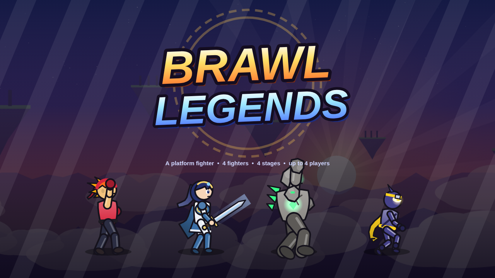
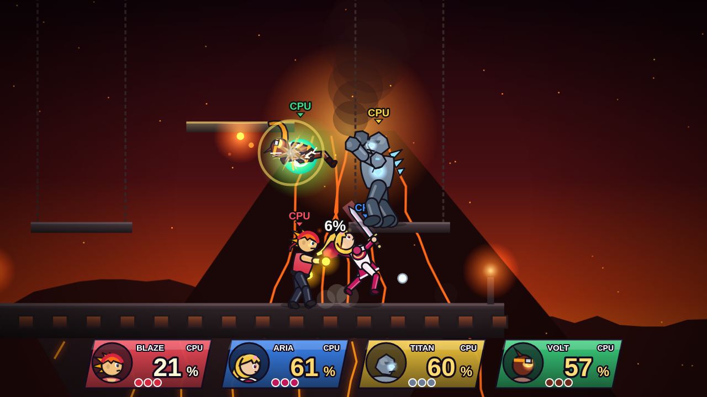

# Brawl Legends

A Smash-style 2D platform fighter for the desktop. Knock your opponents off the
stage: the more damage they take, the farther they fly.




## Features

- **4 fighters**, each with a full moveset: jab combos, tilts, dash attack,
  charged smash attacks, 5 aerials, grabs + pummel + 4 throws, 4 special moves
  and a cinematic **Final Smash**.
  - **Blaze** – fire brawler (fireballs, blazing dash punch, explosive burst)
  - **Aria** – swordswoman (sword beam, multi-slash dash, spinning recovery, counter)
  - **Titan** – stone heavyweight (chargeable punch, super-armoured charge, earthquake stomp)
  - **Volt** – storm ninja (triple jump, shurikens, teleports, lightning strike)
- **4 stages** with animated parallax backgrounds: Sky Temple, Final Frontier,
  Volcano Keep (moving platform, lava sea) and Neon Skydeck (flying shuttle platform).
- Smash-style mechanics: damage % and knockback scaling, hitlag, DI, hitstun and
  tumble, shields (with shield breaks), rolls, spot/air dodges, ledge grabbing and
  ledge options, teching, fast-falling, drop-through platforms, clanks, super
  armour, counters, move staleness, projectiles and multi-hit moves.
- **Items**: healing hearts, throwable bombs and the rainbow **Smash Orb** that
  unlocks your Final Smash.
- **Up to 4 players**: two keyboard layouts plus up to four gamepads, with CPU
  opponents at levels 1–9.
- Stock and timed matches, a **training mode** (with combo counter), pause menu and
  a results screen with stats.
- Procedurally drawn cel-shaded characters (skeletal animation, hair/scarf physics,
  swoosh trails), particle effects, screen shake and synthesised sound effects and music.
  No external assets required.

## Running it

**Desktop app (Electron):**

```bash
npm install
npm start
```

To build an installer for your OS: `npm run dist` (output in `dist/`).

**In a browser:** just open `index.html`, or run `npm run web` and visit
<http://localhost:8080>.

Press **F11** for fullscreen.

## Controls

| Action          | Keyboard A      | Keyboard B                 | Gamepad            |
| --------------- | --------------- | -------------------------- | ------------------ |
| Move            | W A S D         | Arrow keys                 | Left stick / D-pad |
| Jump            | Space (or W)    | Num 0 / `'` (or Up)        | X / Y              |
| Attack          | J               | Num 1 / `.`                | A                  |
| Special         | K               | Num 2 / `/`                | B                  |
| Shield / dodge  | L               | Num 3 / Right Shift        | LB / LT / RT       |
| Grab            | U               | Num 4 / `;`                | RB                 |
| Smash attack    | I + direction   | Num 5 / `,` + direction    | Right stick        |
| Pause           | Esc             | Esc                        | Start              |

- Attack + direction = tilt attacks; in the air = aerials.
- Special + direction = four different specials. **Up special** is your recovery.
- Hold the attack (or smash) button to charge a smash attack.
- Shield + left/right = roll, shield + down = spot dodge, shield in the air = air dodge.
- Press shield just before hitting the ground while tumbling to **tech**.
- Grab, then push a direction to throw (attack to pummel).
- On a ledge: toward/up = climb, jump, attack or shield for other get-ups.
- Break the Smash Orb, then press special for your Final Smash.

## Tests

```bash
npm test                     # needs the `playwright` package
node tests/run-tests.js --shots   # also saves screenshots to tests/screenshots/
node tests/pose-sheet.js     # renders every pose/attack frame with hitboxes
```

The test suite loads the game in headless Chromium, walks through the menus,
simulates 16 full four-player CPU matches (every stage × every character), and
checks every move, knockback scaling, shields, grabs/throws, recovery, Final
Smashes, items, time/training modes, keyboard input mapping and CPU difficulty
scaling.

## Project layout

```
index.html            entry page (loads the scripts below)
electron/main.js      desktop window wrapper
src/core/             math utils, input (keyboard/gamepad/mouse), audio synth
src/game/             skeleton rig, moves, characters, fighter physics & state
                      machine, stages, projectiles, items, final smashes, AI, match
src/render/           fighter renderer and match/HUD renderer
src/ui/               menu widgets and screens
tests/                automated tests
```
