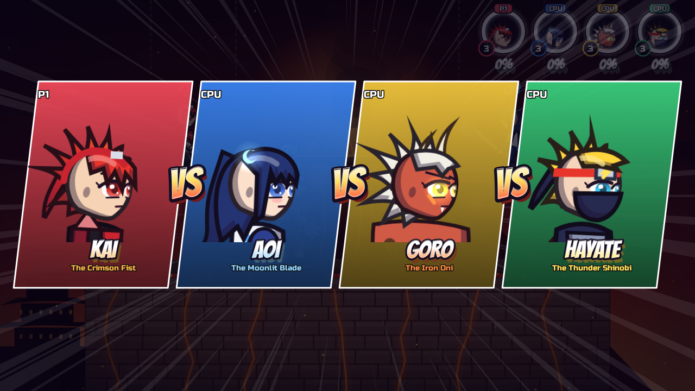
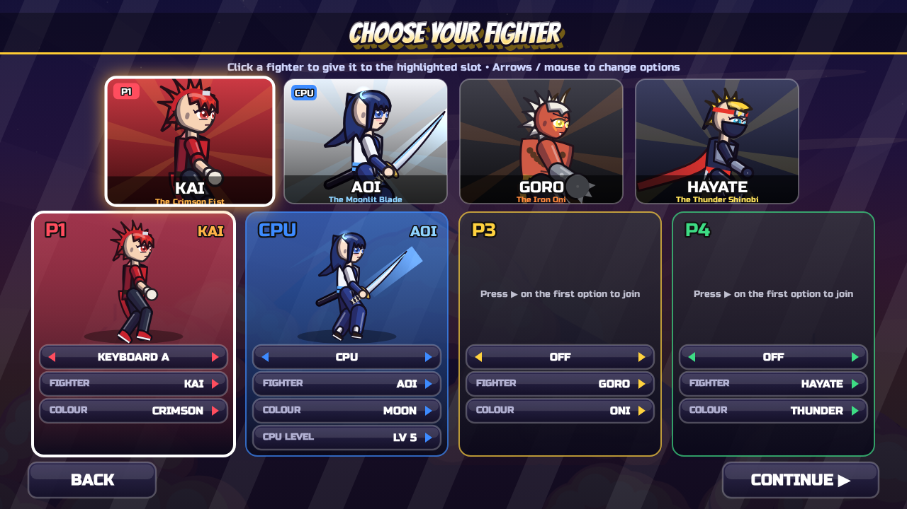
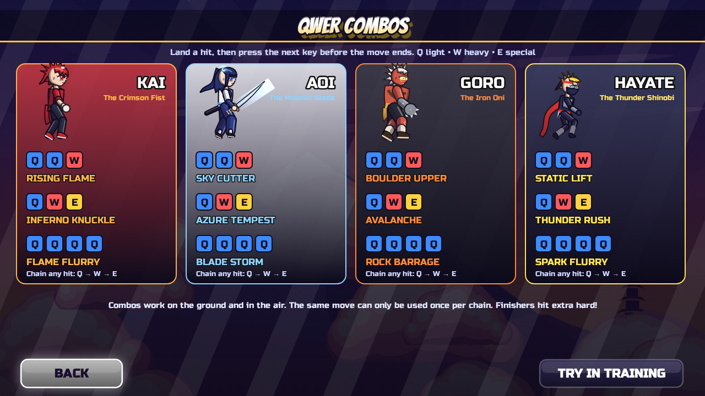

# Brawl Legends

An anime-style 2D platform fighter for the desktop, played like Brawlhalla and built
around **QWER combos**. Move with the arrow keys, crouch with Shift, dodge with
Space, and chain Q, W, E and R attacks into named combos. Grab weapons that drop
from the sky and knock your opponents off the stage: the more damage they take,
the farther they fly.







## Features

- **4 anime fighters**, each with a full moveset: jab combos, tilts, dash attack,
  charged heavy attacks, 5 aerials, ground pound, grabs + pummel + 4 throws,
  4 special moves and a cinematic **Final** with a full-screen cut-in.
  - **Kai Homura, the Crimson Fist**: fire brawler with spiky red hair, a jacket and a headband
  - **Aoi Tsukishiro, the Moonlit Blade**: katana swordswoman in kimono and hakama
  - **Goro, the Iron Oni**: horned heavyweight with iron gauntlets and a mace fist
  - **Hayate, the Thunder Shinobi**: masked ninja with a flowing scarf
- **4 anime stages** with animated parallax backgrounds: Sakura Shrine (torii,
  cherry blossoms), Moonlit Summit (aurora, giant moon), Oni Fortress (moving
  platform, lava) and Neo Tokyo (neon rain, passing train).
- **Brawlhalla-style play**: dodges instead of shields (spot dodge, roll,
  air dodge), 3 jumps for everyone, **wall cling and wall jumps** on the stage
  sides, a **ground pound** (Down + W in the air), and **weapon drops**
  (katana, hammer, spear): R picks one up, R throws it. A held weapon gives your
  hand attacks more reach and damage.
- Platform-fighter mechanics: damage % and knockback scaling, hitlag, DI, hitstun
  and tumble, teching, fast-falling, drop-through platforms, clanks, super armour,
  counters, move staleness, projectiles and multi-hit moves.
- **Items**: healing hearts, throwable bombs and the rainbow **Smash Orb** that
  unlocks your Final.
- **Up to 4 players**: two keyboard layouts plus up to four gamepads, with CPU
  opponents at levels 1–9.
- Stock and timed matches, a **training mode** (with combo counter), pause menu and
  a results screen with stats.
- **Anime graphics**, all drawn in code:
  - Cel-shaded characters with coloured line art, 3/4-view faces, glossy eyes,
    expressions (angry, shouting, hurt, smiling) and blinking.
  - Spiky hair with highlight bands, and physics on hair, scarves and coat tails.
  - Skeletal animation with afterimages and auras.
  - Bloom glow, anime **impact frames** (inverted flash with speed lines),
    spiked hit sparks and slash crescents.
  - A VS splash before each match, a cut-in banner for Finals, and a portrait HUD
    whose ring changes colour with damage.
- Synthesised sound effects and music. The only bundled assets are two open-licence
  fonts (Bangers and Russo One, SIL OFL; see `assets/fonts/LICENSE.txt`).

## Running it

**Desktop app (Electron):**

```bash
npm install
npm start
```

To build an installer for your OS: `npm run dist` (output in `dist/`).

**In a browser:** just open `index.html`, or run `npm run web` and visit
<http://localhost:8080>.

Press **F11** for fullscreen.

## Controls

| Action           | Keyboard A    | Keyboard B            | Gamepad            |
| ---------------- | ------------- | --------------------- | ------------------ |
| Move             | Arrow keys    | Num 4 5 6 / J K L     | Left stick / D-pad |
| Jump             | Up arrow      | Num 8 / I             | X                  |
| Crouch           | Shift         | Num 2 / M             | Stick down / L3    |
| **Q** Light attack | Q           | Num 7 / U             | A                  |
| **W** Heavy / smash | W          | Num 9 / O             | Y / right stick    |
| **E** Special    | E             | Num 1 / P             | B                  |
| **R** Grab / weapon | R          | Num 3 / `[`           | RB                 |
| Dodge            | Space         | Num 0 / N             | LB / LT / RT       |
| Pause            | Esc           | Esc                   | Start              |

- Direction + Q = tilt attacks (in the air: aerials). Shift + Q = low sweep.
- Direction + W = heavy attacks (hold W to charge). **Down + W in the air** = ground pound.
- Direction + E = four different specials. **Up + E** is your recovery.
- Space = spot dodge, Space + left/right = roll, Space in the air = air dodge. Tap
  Space just before landing while tumbling to **tech**. Shift or Down in the air =
  fast fall.
- In the air, hold toward a stage wall to **cling** to it; press Up to wall-jump.
- R picks up a weapon lying nearby and throws the one you hold (aim with Up/Down).
  With empty hands R grabs; then a direction throws (Q to pummel).
- Break the Smash Orb, then press E for your Final.

## QWER combos

When a hit **lands**, press the next key to cancel into another attack. Chains go
from light to heavy to special: **Q → W → E**. The same move can only be used once
per chain. Hits in the middle of a chain keep the opponent close, so the next hit
connects. Presses made slightly early are queued, so mashing works too.

These key strings are **named combos** with their own finishing moves:

| Keys      | Kai             | Aoi           | Goro          | Hayate        |
| --------- | --------------- | ------------- | ------------- | ------------- |
| Q Q W     | Rising Flame    | Sky Cutter    | Boulder Upper | Static Lift   |
| Q W E     | Inferno Knuckle | Azure Tempest | Avalanche     | Thunder Rush  |
| Q Q Q Q   | Flame Flurry    | Blade Storm   | Rock Barrage  | Spark Flurry  |

- **Launcher** (Q Q W) knocks the opponent upward so you can jump and keep going with aerials.
- **Finisher** (Q W E) is a big move with its own animation and extra impact.
- **Flurry** (Q Q Q Q) is a string of rapid hits ending in a push.

A combo counter under your HUD portrait shows hits and total damage. The **COMBOS**
menu lists every fighter's combos, and training mode shows a cheat sheet on screen.
CPU opponents use combos too, more often at higher levels.

## Tests

```bash
npm test                     # needs the `playwright` package
node tests/run-tests.js --shots   # also saves screenshots to tests/screenshots/
node tests/pose-sheet.js     # renders every pose/attack frame with hitboxes
```

The test suite loads the game in headless Chromium, walks through the menus,
simulates 16 full four-player CPU matches (every stage × every character), and
checks every named QWER combo at several input speeds, every move, knockback
scaling, dodges, grabs/throws, recovery, wall cling and wall jumps, ground pound,
weapon pickup/reach/throw, Finals, items, time/training modes, keyboard input
mapping and CPU difficulty scaling.

Developer notes and ideas for future work: [docs/DEV_NOTES.md](docs/DEV_NOTES.md).

## Project layout

```
index.html            entry page (loads the scripts below)
electron/main.js      desktop window wrapper
assets/fonts/         bundled display/UI fonts (SIL OFL)
src/core/             math utils, input (keyboard/gamepad/mouse), audio synth
src/game/             skeleton rig, moves, characters, fighter physics & state
                      machine, stages, projectiles, items, final smashes, AI, match
src/render/           fighter renderer and match/HUD renderer
src/ui/               menu widgets and screens
tests/                automated tests
```
